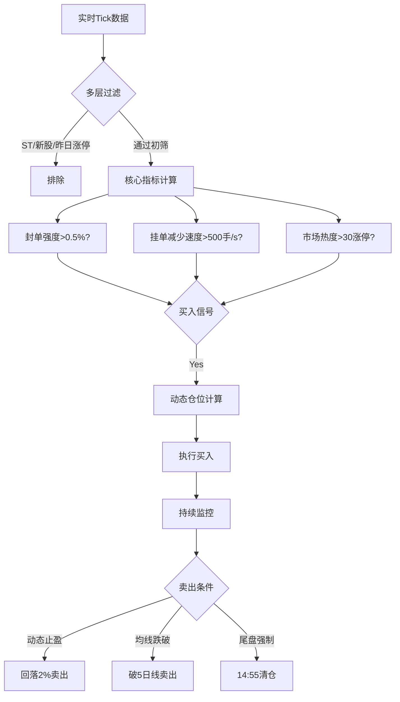

# curs
Curs is an personal automated quantitative investment platform.
## Strategy

## Install
python 3.10 recommended!
```bash
pip install -r requirements.txt
```
```bash
python setup.py install 
```


## Module

collection   数据采集

data_source   历史数据

log_handler   日志

real_quote    实时行情

utils		公共包

strategy_loader   策略热加载

main			主程序逻辑  
## Back trader 

## 交易接口接入
- miniqmt

## todolist
- 数据存储改为postgresql
- 新增统计策略，统计当天涨停，跌停，涨停炸板
