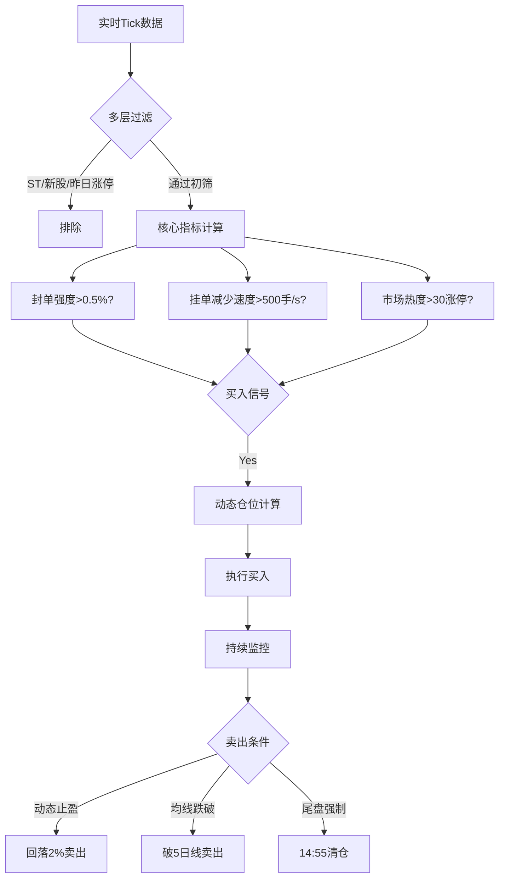

# curs

Curs 是一个个人自动化量化投资平台。

[English Version](README_EN.md) | 中文版

## 功能特性

- **实时行情** - 支持从 QMT 获取实时 Tick 数据
- **策略交易** - 支持多策略同时运行，策略热加载
- **信号管理** - 买卖信号自动生成、存储和执行
- **持仓管理** - 实时持仓监控，一键清仓
- **股票池** - 自定义股票池，分类管理
- **定时任务** - 可配置定时执行数据同步、盈利分析等任务
- **Web 界面** - 图形化监控和管理

## 策略逻辑


```mermaid
graph TD
    A[实时Tick数据] --> B{多层过滤}
    B -->|ST/新股/昨日涨停| C[排除]
    B -->|通过初筛| D[核心指标计算]
    D --> E[封单强度>0.5%?]
    D --> F[挂单减少速度>500手/s?]
    D --> G[市场热度>30涨停?]
    E & F & G --> H{买入信号}
    H -->|Yes| I[动态仓位计算]
    I --> J[执行买入]
    J --> K[持续监控]
    K --> L{卖出条件}
    L -->|动态止盈| M[回落2%卖出]
    L -->|均线跌破| N[破5日线卖出]
    L -->|尾盘强制| O[14:55清仓]
```

## 环境要求

- Python 3.10+ (推荐)
- PostgreSQL 12+
- QMT 客户端（实盘交易需要）

## 安装

```bash
# 克隆项目
git clone <repository-url>
cd curs

# 创建虚拟环境（可选）
python -m venv venv
venv\Scripts\activate  # Windows
# source venv/bin/activate  # Linux/Mac

# 安装依赖
pip install -r requirements.txt

# 安装项目
python setup.py install
```

## 配置

配置文件 `config.yml`（敏感配置请使用 `config.local.yml`）：

```yaml
version: 0.1.0

# 数据库配置
database:
  host: 192.168.2.12
  port: 6432
  database: postgres
  user: postgres
  password: ""  # 建议使用 config.local.yml

# QMT 配置
qmt:
  path: ""
  account_id: ""  # 建议使用 config.local.yml
  trader_name: ""

# 策略配置
strategy:
  path: ./strategies
```

### 本地配置

敏感信息请放在 `config.local.yml`（已被 gitignore 忽略）：

```yaml
database:
  password: your_password

qmt:
  path: E:\qmt\userdata_mini
  account_id: "YOUR_ACCOUNT_ID"
  trader_name: curs
```

或使用环境变量：

```bash
set CURS_DB_PASSWORD=your_password
set CURS_QMT_ACCOUNT_ID=YOUR_ACCOUNT_ID
```

## 项目结构

```
curs/
├── curs/
│   ├── api/              # API 接口
│   ├── broker/           # 交易接口 (QMT)
│   ├── collection/       # 数据采集
│   ├── core/             # 核心引擎
│   ├── data_source/      # 历史数据
│   ├── database.py       # 数据库管理
│   ├── log_handler/      # 日志模块
│   ├── strategy/         # 策略加载执行
│   └── utils/            # 工具函数
│       └── task_scheduler.py  # 定时任务调度器
├── web/
│   ├── app.py            # Web 服务
│   └── templates/        # 前端页面
├── strategies/           # 策略文件目录
├── data/                 # 数据目录
│   └── create_scheduled_tasks.sql  # 定时任务表SQL
├── test/                 # 测试文件
└── config.yml            # 配置文件
```

## 数据库初始化

首次运行前需要创建数据库表：

```bash
# 创建数据库表
psql -h 192.168.2.12 -U postgres -d postgres -f data/create_scheduled_tasks.sql
```

或者通过 Web 界面自动创建（首次访问时会尝试创建）。

## 启动

```bash
# 使用统一入口启动（推荐）
python run.py                    # 启动所有服务
python run.py --help             # 查看帮助

# 单独启动
python run.py --web-only         # 仅启动Web服务
python run.py --engine-only      # 仅启动交易引擎

# 指定端口
python run.py -p 8080            # Web端口8080
```

访问 http://localhost:5000 进入管理界面。

## Web 界面功能

| 模块 | 说明 |
|------|------|
| 策略管理 | 查看和管理交易策略 |
| 信号查询 | 查询买卖信号，支持筛选 |
| 股票池 | 管理股票池，批量添加/删除 |
| 持仓管理 | 查看持仓，一键清仓 |
| 定时任务 | 配置和管理定时任务 |

## 定时任务

定时任务模块支持：

- **Cron 表达式** - 灵活的时间配置，如 `0 15 * * *` 表示每天 15:00
- **固定间隔** - 按秒/分钟/小时执行
- **多种任务类型**：
  - 同步热点股票
  - 同步股票信息
  - 盈利分析
  - 清除热点股票
- **执行日志** - 记录每次执行结果，支持查看历史

### 添加定时任务

通过 Web 界面 `定时任务` 页面：
1. 填写任务名称
2. 选择任务类型
3. 配置 Cron 表达式或间隔秒数
4. 点击创建

### Cron 表达式示例

| 表达式 | 说明 |
|--------|------|
| `* * * * *` | 每分钟 |
| `0 * * * *` | 每小时整点 |
| `0 15 * * *` | 每天 15:00 |
| `0 9 * * 1-5` | 每周一到周五 9:00 |
| `0 0 * * *` | 每天午夜 |

## 模块说明

| 模块 | 说明 |
|------|------|
| collection | 数据采集（热点股票、龙虎榜等） |
| data_source | 历史数据存储和读取 |
| broker | QMT 交易接口封装 |
| strategy | 策略加载和执行框架 |
| core | 核心引擎（事件调度、数据分发） |
| utils | 工具函数 |

## 依赖

核心依赖：
- pandas, numpy - 数据处理
- pytdx - 行情数据获取
- backtrader - 回测框架
- Flask - Web 框架
- psycopg2-binary - PostgreSQL
- schedule, croniter - 定时任务

完整依赖见 `requirements.txt`

## TODO

- [x] 数据存储改为 PostgreSQL
- [x] 定时任务管理
- [ ] 新增统计策略（当天涨停、跌停、涨停炸板）
- [ ] 回测优化
- [ ] 策略绩效分析
