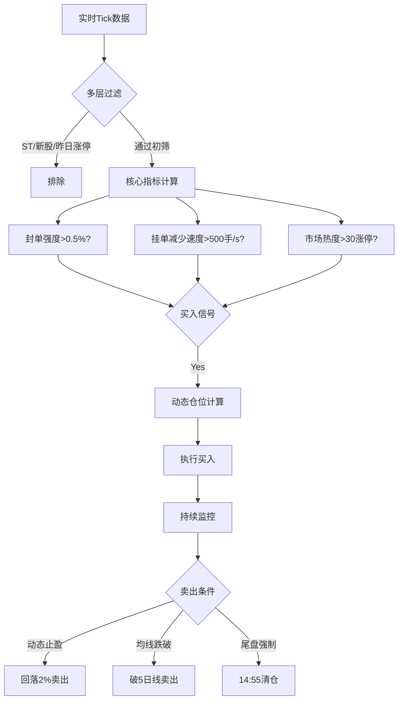

# curs

Curs 是一个个人自动化量化投资平台。

[English Version](README_EN.md) | 中文版

## 功能特性

- **实时行情** - 支持从 QMT 获取实时 Tick 数据
- **多交易商** - 交易账户支持 QMT 或东方财富证券
- **策略交易** - 支持多策略同时运行，策略热加载
- **信号管理** - 买卖信号自动生成、存储和执行
- **持仓管理** - 实时持仓监控，一键清仓
- **股票池** - 自定义股票池，分类管理
- **定时任务** - 可配置定时执行数据同步、盈利分析等任务
- **Web 界面** - 图形化监控和管理

## 策略逻辑


```mermaid
graph TD
    A[实时Tick数据] --> B{多层过滤}
    B -->|ST/新股/昨日涨停| C[排除]
    B -->|通过初筛| D[核心指标计算]
    D --> E[封单强度>0.5%?]
    D --> F[挂单减少速度>500手/s?]
    D --> G[市场热度>30涨停?]
    E & F & G --> H{买入信号}
    H -->|Yes| I[动态仓位计算]
    I --> J[执行买入]
    J --> K[持续监控]
    K --> L{卖出条件}
    L -->|动态止盈| M[回落2%卖出]
    L -->|均线跌破| N[破5日线卖出]
    L -->|尾盘强制| O[14:55清仓]
```

## 环境要求

- Python 3.10+ (推荐)
- PostgreSQL 12+
- QMT/MiniQMT 客户端（当前实时行情需要）
- 实盘账户：QMT 交易账户或可用的东方财富证券账户（二选一）

## 安装

```bash
# 克隆项目
git clone <repository-url>
cd curs

# 创建虚拟环境（可选）
python -m venv venv
venv\Scripts\activate  # Windows
# source venv/bin/activate  # Linux/Mac

# 安装依赖
pip install -r requirements.txt

# 安装项目
python setup.py install
```

## 配置

配置文件 `config.yml`（敏感配置请使用 `config.local.yml`）：

```yaml
version: 0.1.0

# 数据库配置
database:
  host: 192.168.2.238
  port: 6432
  database: postgres
  user: postgres
  password: ""  # 建议使用 config.local.yml

# 交易商，可选 qmt 或 eastmoney
broker: qmt

# QMT 配置（broker: qmt 时使用）
qmt:
  path: ""
  account_id: ""  # 建议使用 config.local.yml
  trader_name: ""

# 东方财富配置（broker: eastmoney 时使用）
eastmoney:
  account_no: ""
  password: ""  # 必须放在 config.local.yml 或环境变量中
  session_file: data/eastmoney_trader.session

# 策略配置
strategy:
  path: ./strategies
```

### 本地配置

敏感信息请放在 `config.local.yml`（已被 gitignore 忽略）：

```yaml
database:
  password: your_password

qmt:
  path: E:\qmt\userdata_mini
  account_id: "YOUR_ACCOUNT_ID"
  trader_name: curs
```

使用东方财富时，本地配置改为：

```yaml
broker: eastmoney

eastmoney:
  account_no: "YOUR_FUND_ACCOUNT"
  password: "YOUR_TRADING_PASSWORD"
  session_file: data/eastmoney_trader.session
```

或使用环境变量：

```bash
set CURS_DB_PASSWORD=your_password
set CURS_QMT_ACCOUNT_ID=YOUR_ACCOUNT_ID
```

东方财富也可完全通过环境变量配置：

```bat
set CURS_BROKER=eastmoney
set CURS_EASTMONEY_ACCOUNT_NO=YOUR_FUND_ACCOUNT
set CURS_EASTMONEY_PASSWORD=YOUR_TRADING_PASSWORD
set CURS_EASTMONEY_SESSION_FILE=data/eastmoney_trader.session
```

## 东方财富证券接入

东方财富接入使用资金账号和交易密码登录网页交易网关，不通过 QMT 下单。首次登录会自动识别图片验证码，并将登录会话缓存到 `session_file`；缓存失效后会自动重新登录。由于当前行情引擎仍基于 `xtquant`，运行实时策略前仍需启动 MiniQMT 行情服务。

1. 确认东方财富证券网页交易可正常登录，账户未被锁定，交易权限正常。
2. 执行 `pip install -r requirements.txt`，安装 `pycryptodome`、`ddddocr` 和 `pillow`。
3. 在已被 Git 忽略的 `config.local.yml` 中设置 `broker: eastmoney`、资金账号和交易密码。
4. 启动 MiniQMT 行情服务；东方财富仅替换交易账户，不替换现有行情源。
5. 首次建议执行 `python run.py --engine-only -v`，观察日志中是否出现“东方财富账户登录成功”。
6. 启动完整服务后访问持仓管理页面，核对资金和持仓。先在 Web 策略管理中关闭实盘，仅验证信号；确认无误后再开启实盘。

策略通过统一工厂创建账户，无需写死交易商：

```python
from curs.broker import create_account

context.account = create_account(config, total_cash=100000)
```

目前东方财富适配支持资金与持仓查询、限价/市价参数买卖、撤单、当日委托与成交、一键清仓。A 股仍遵循 T+1；清仓只卖出接口返回的可用数量。行情引擎当前仍使用 QMT/xtquant 数据链路，因此选择东方财富只替换交易账户，不会替换行情源。

> 风险提示：该接入依赖东方财富网页交易接口，接口或登录校验变化可能导致不可用。`config.local.yml` 和 `*.session` 都包含敏感信息，不应提交、分享或放入同步盘。请先小额、信号模式验证，实盘交易风险由使用者自行承担。

## 项目结构

```
curs/
├── curs/
│   ├── api/              # API 接口
│   ├── broker/           # 交易接口 (QMT / 东方财富)
│   ├── collection/       # 数据采集
│   │   └── eastmoney_hot_stocks.py  # 东财热点股票
│   ├── core/             # 核心引擎
│   ├── data_source/      # 历史数据
│   ├── database.py       # 数据库管理
│   ├── log_handler/      # 日志模块
│   ├── strategy/         # 策略加载执行
│   └── utils/            # 工具函数
│       ├── config.py          # 配置加载（支持本地覆盖）
│       ├── task_scheduler.py  # 定时任务调度器
│       └── task_callbacks.py  # 动态任务执行器
├── web/
│   ├── app.py            # Web 服务
│   └── templates/        # 前端页面
├── strategies/           # 策略文件目录
├── data/                 # 数据目录
│   └── create_scheduled_tasks.sql  # 定时任务表SQL
├── test/                 # 测试文件
│   ├── test_config.py           # 配置模块测试
│   ├── test_task_scheduler.py   # 任务调度测试
│   └── test_task_callbacks.py   # 任务执行测试
├── .github/
│   └── workflows/        # GitHub Actions CI
├── run.py                # 统一启动入口
└── config.yml            # 配置文件
```

## 数据库初始化

首次运行前需要创建数据库表：

```bash
# 创建数据库表
psql -h 192.168.2.238 -U postgres -d postgres -f data/create_scheduled_tasks.sql
```

或者通过 Web 界面自动创建（首次访问时会尝试创建）。

## 启动

```bash
# 使用统一入口启动（推荐）
python run.py                    # 启动所有服务（Web + 引擎）
python run.py --help             # 查看帮助

# 单独启动
python run.py --web-only         # 仅启动Web服务
python run.py --engine-only      # 仅启动交易引擎

# 指定端口
python run.py -p 8080            # Web端口8080
```

访问 http://localhost:5000 进入管理界面。

### 批处理脚本

`E:\script\` 目录下提供了 Windows 批处理脚本：

| 脚本 | 说明 |
|------|------|
| `start_all.bat` | 一键启动 QMT + Curs（Web + 引擎） |
| `startqmt.bat` | 单独启动 QMT |
| `startcurs.bat` | 单独启动 Curs |
| `start_web.bat` | 仅启动 Web 服务 |
| `restart_premarket.bat` | 盘前重启（杀进程 → 重启 QMT → 启动 Curs） |
| `after_daily.bat` | 盘后选股 |
| `setup_schedule.bat` | 配置 Windows 定时任务 |

### Windows 定时任务

通过 `setup_schedule.bat` 可配置以下定时任务：

| 任务 | 触发时间 | 说明 |
|------|----------|------|
| `CursBoot` | 登录时 | 启动 QMT + Curs |
| `CursPreMarket` | 工作日 08:50 | 盘前重启 QMT + Curs |
| `CursAfterMarket` | 工作日 16:00 | 盘后选股 |
| `CursDailyImport` | 每日 21:00 | 导入采集数据 |

## 架构说明

Curs 采用**单进程架构**，Web 服务和交易引擎运行在同一进程中：

```
run.py (单进程)
├── Web 服务 (Flask, 端口 5000)
└── 交易引擎 (Engine)
    ├── 策略管理器 (StrategyManager)
    ├── 交易账户 (QmtStockAccount / EastMoneyAccount)
    └── 行情引擎 (Quote Engine)
```

- **策略模式切换**：Web 页面可直接切换策略的实盘/信号模式
  - 实盘模式：正常接收行情 + 执行下单
  - 信号模式：接收行情 + 生成信号写 DB，跳过真实下单
- **交易商启动**：QMT 模式自动检测并启动 QMT；东方财富模式在策略初始化时登录
- **curs_main.py**：兼容壳，重定向到 `run.py`

## Web 界面功能

| 模块 | 说明 |
|------|------|
| 策略管理 | 查看和管理交易策略 |
| 信号查询 | 查询买卖信号，支持筛选 |
| 股票池 | 管理股票池，批量添加/删除 |
| 持仓管理 | 查看持仓，一键清仓 |
| 定时任务 | 配置和管理定时任务 |

## 定时任务

定时任务模块支持：

- **Cron 表达式** - 灵活的时间配置，如 `0 15 * * *` 表示每天 15:00
- **固定间隔** - 按秒/分钟/小时执行
- **动态任务执行** - 支持运行任意 Python 脚本函数（通过 Web UI 配置脚本路径 + 函数名）
- **多种任务类型**：
  - 同步热点股票
  - 同步股票信息
  - 盈利分析
  - 清除热点股票
- **执行日志** - 记录每次执行结果，支持查看历史

### 添加定时任务

通过 Web 界面 `定时任务` 页面：
1. 填写任务名称
2. 选择任务类型
3. 配置 Cron 表达式或间隔秒数
4. 点击创建

### Cron 表达式示例

| 表达式 | 说明 |
|--------|------|
| `* * * * *` | 每分钟 |
| `0 * * * *` | 每小时整点 |
| `0 15 * * *` | 每天 15:00 |
| `0 9 * * 1-5` | 每周一到周五 9:00 |
| `0 0 * * *` | 每天午夜 |

## 模块说明

| 模块 | 说明 |
|------|------|
| collection | 数据采集（热点股票、龙虎榜等） |
| data_source | 历史数据存储和读取 |
| broker | QMT / 东方财富交易接口封装 |
| strategy | 策略加载和执行框架 |
| core | 核心引擎（事件调度、数据分发） |
| utils | 工具函数 |

## 依赖

核心依赖：
- pandas, numpy - 数据处理
- pytdx - 行情数据获取
- Flask - Web 框架
- psycopg2-binary - PostgreSQL
- schedule, croniter - 定时任务

完整依赖见 `requirements.txt`

## Trading Agent（开发中）

`codex/trading-agent` 分支包含多市场 Trading Agent 的第一阶段内核。它采用“本地分钟指标发现候选信号 → AI 返回结构化决策 → 硬风控 → 统一订单执行”的链路，AI 不能直接调用交易账户。

当前已经提供：

- 跨市场标的编码：A 股、美股、加密货币、外汇。
- 标准 `Bar`、`CandidateSignal`、`Decision` 和 `OrderIntent` 模型。
- A 股、美股、加密货币、外汇的数量与价格精度规则。
- 安全 `StrategySpec`，只支持白名单字段和比较运算符，不执行模型生成的 Python。
- 一句话策略生成接口和需要补充信息的反馈机制。
- 1/5/15 分钟 Tick 聚合、增量指标、信号检测、去重与冷却。
- 严格 AI JSON 决策协议；未配置 AI 时默认 `HOLD`。
- 统一模型适配层，支持 OpenAI、DeepSeek、Claude 和 OpenAI 兼容服务。
- 仓位分配、硬风控、幂等订单执行和 JSONL 审计日志。
- 现有 QMT/东方财富账户兼容适配器及 QMT Tick 事件桥接器。

默认配置不会启动 Trading Agent 或真实下单：

```yaml
trading_agent:
  enabled: false
  journal_file: data/trading_agent/events.jsonl
  llm:
    enabled: false
    provider: openai
    model: gpt-5
    api_key_env: OPENAI_API_KEY
    timeout_seconds: 8
    max_retries: 1
  risk:
    max_single_order_value: 10000
    max_symbol_exposure_pct: 0.15
    max_total_exposure_pct: 0.50
    max_positions: 5
    max_daily_loss_pct: 0.02
    max_market_data_age_seconds: 90
  strategies: []
```

模型密钥必须通过环境变量设置，不能写入仓库。例如 PowerShell：

```powershell
$env:OPENAI_API_KEY = "你的密钥"
```

切换供应商只需修改 `llm` 配置：DeepSeek 使用 `provider: deepseek`、`model: deepseek-chat` 和 `DEEPSEEK_API_KEY`；Claude 使用 `provider: anthropic`、Claude 模型名和 `ANTHROPIC_API_KEY`。私有部署或其他兼容服务使用 `provider: openai_compatible` 并设置 `base_url`。配置完成后仍需显式设置 `llm.enabled: true`，模型异常、超时或返回非法 JSON 时不会下单。

主要代码位于 `curs/domain/`、`curs/markets/` 和 `curs/trading_agent/`。当前阶段提供可测试的运行内核、QMT 桥接和模型供应商配置；下一阶段将增加数据库策略注册、Engine 生命周期接入和 Web 管理页面。

## 测试

项目使用 `unittest` 测试框架，运行测试：

```bash
# 运行所有测试
python -m unittest discover -s test

# 运行单个测试文件
python -m unittest test.test_config

# 运行指定测试函数
python -m unittest test.test_config.TestConfigLoader.test_load_config
```

CI 使用 GitHub Actions 自动运行测试（仅运行已验证通过的测试文件）。

## 开发方向

- 实盘交易 - 优化交易执行和风险管理
- 策略优化 - 提升策略盈利能力
- 数据采集 - 定时任务自动化（热点股票、盈利分析等）
  - 多平台排行榜（东财、同花顺、雪球等）
  - 新闻资讯抓取与分析
  - 龙虎榜、资金流向、板块轮动

## TODO

- [x] 数据存储改为 PostgreSQL
- [x] 定时任务管理
- [x] 单元测试（配置、任务调度、任务执行）
- [x] CI/CD 集成（GitHub Actions）
- [x] 单进程架构（Web + 引擎）
- [x] 策略实盘/信号模式切换
- [x] QMT 自动启动
- [ ] 数据采集增强（多平台、新闻分析）
- [ ] 实盘交易优化
- [ ] 策略绩效分析
