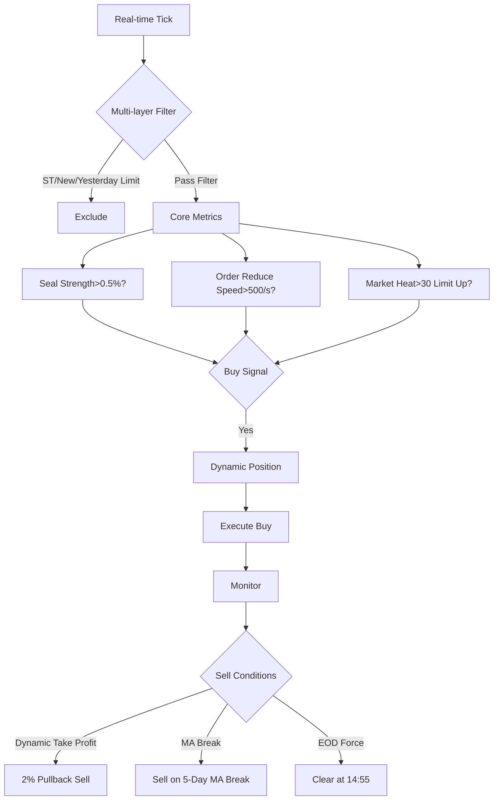

# curs

Curs is a personal automated quantitative investment platform.

[中文版](README.md) | English Version

## Features

- **Real-time Quotes** - Get real-time Tick data from QMT
- **Strategy Trading** - Multi-strategy support with hot reloading
- **Signal Management** - Auto-generate, store and execute trading signals
- **Position Management** - Real-time position monitoring, one-click liquidation
- **Stock Pool** - Custom stock pools with categorization
- **Scheduled Tasks** - Configurable periodic tasks for data sync, profit analysis, etc.
- **Web Interface** - Graphical monitoring and management

## Strategy Logic



## Requirements

- Python 3.10+ (recommended)
- PostgreSQL 12+
- QMT client (required for live trading)

## Installation

```bash
# Clone project
git clone <repository-url>
cd curs

# Create virtual environment (optional)
python -m venv venv
venv\Scripts\activate  # Windows
# source venv/bin/activate  # Linux/Mac

# Install dependencies
pip install -r requirements.txt

# Install project
python setup.py install
```

## Configuration

`config.yml` (sensitive config should use `config.local.yml`):

```yaml
version: 0.1.0

# Database config
database:
  host: 192.168.2.12
  port: 6432
  database: postgres
  user: postgres
  password: ""  # Use config.local.yml

# QMT config
qmt:
  path: ""
  account_id: ""  # Use config.local.yml
  trader_name: ""

# Strategy config
strategy:
  path: ./strategies
```

### Local Config

Put sensitive data in `config.local.yml` (gitignored):

```yaml
database:
  password: your_password

qmt:
  path: E:\qmt\userdata_mini
  account_id: "YOUR_ACCOUNT_ID"
  trader_name: curs
```

Or use environment variables:

```bash
set CURS_DB_PASSWORD=your_password
set CURS_QMT_ACCOUNT_ID=YOUR_ACCOUNT_ID
```

## Project Structure

```
curs/
├── curs/
│   ├── api/              # API endpoints
│   ├── broker/           # Trading interface (QMT)
│   ├── collection/       # Data collection
│   ├── core/             # Core engine
│   ├── data_source/      # Historical data
│   ├── database.py       # Database manager
│   ├── log_handler/      # Logging
│   ├── strategy/         # Strategy loader
│   └── utils/            # Utilities
│       └── task_scheduler.py  # Task scheduler
├── web/
│   ├── app.py            # Web service
│   └── templates/        # Frontend pages
├── strategies/           # Strategy files
├── data/                 # Data files
│   └── create_scheduled_tasks.sql
├── test/                 # Test files
└── config.yml            # Configuration
```

## Database Setup

Create tables before first run:

```bash
psql -h 192.168.2.12 -U postgres -d postgres -f data/create_scheduled_tasks.sql
```

Or via Web UI (auto-created on first access).

## Running

```bash
# Use unified launcher (recommended)
python run.py                    # Start all services
python run.py --help             # Show help

# Run separately
python run.py --web-only         # Web service only
python run.py --engine-only      # Trading engine only

# Specify port
python run.py -p 8080            # Web port 8080
```

Visit http://localhost:5000

## Web Interface

| Module | Description |
|--------|-------------|
| Strategies | View and manage trading strategies |
| Signals | Query trading signals with filters |
| Stock Pool | Manage stock pools, batch add/remove |
| Positions | View positions, one-click liquidation |
| Scheduled Tasks | Configure and manage periodic tasks |

## Scheduled Tasks

Features:

- **Cron Expression** - Flexible timing, e.g., `0 15 * * *` = daily at 15:00
- **Fixed Interval** - Execute by seconds/minutes/hours
- **Task Types**:
  - Sync hot stocks
  - Sync stock info
  - Profit analysis
  - Clear hot stocks
- **Execution Logs** - Record and view history

### Adding Tasks

Via Web UI `Scheduled Tasks` page:
1. Enter task name
2. Select task type
3. Configure Cron or interval
4. Click Create

### Cron Examples

| Expression | Description |
|------------|-------------|
| `* * * * *` | Every minute |
| `0 * * * *` | Every hour |
| `0 15 * * *` | Daily at 15:00 |
| `0 9 * * 1-5` | Weekdays at 9:00 |
| `0 0 * * *` | Daily at midnight |

## Modules

| Module | Description |
|--------|-------------|
| collection | Data collection (hot stocks,龙虎榜, etc.) |
| data_source | Historical data storage |
| broker | QMT trading interface |
| strategy | Strategy loading and execution |
| core | Core engine (event dispatch, data feed) |
| utils | Utility functions |

## Dependencies

Core:
- pandas, numpy - Data processing
- pytdx - Market data
- Flask - Web framework
- psycopg2-binary - PostgreSQL
- schedule, croniter - Scheduling

Full list in `requirements.txt`

## Documentation

- [中文文档](README.md)
- [English Documentation](README_EN.md)

## TODO

- [x] PostgreSQL storage
- [x] Scheduled tasks management
- [ ] Statistics strategy (daily limit up/down/broken)
- [ ] Strategy performance analysis
