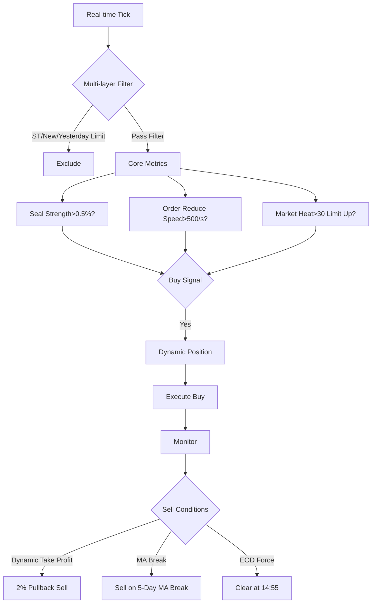

# curs

Curs is a personal automated quantitative investment platform.

[中文版](README.md) | English Version

## Features

- **Real-time Quotes** - Get real-time Tick data from QMT
- **Multiple Brokers** - Use either QMT or Eastmoney Securities for the trading account
- **Strategy Trading** - Multi-strategy support with hot reloading
- **Signal Management** - Auto-generate, store and execute trading signals
- **Position Management** - Real-time position monitoring, one-click liquidation
- **Stock Pool** - Custom stock pools with categorization
- **Scheduled Tasks** - Configurable periodic tasks for data sync, profit analysis, etc.
- **Web Interface** - Graphical monitoring and management

## Strategy Logic


```mermaid
graph TD
    A[Real-time Tick] --> B{Multi-layer Filter}
    B -->|ST/New/Yesterday Limit| C[Exclude]
    B -->|Pass Filter| D[Core Metrics]
    D --> E[Seal Strength>0.5%?]
    D --> F[Order Reduce Speed>500/s?]
    D --> G[Market Heat>30 Limit Up?]
    E & F & G --> H{Buy Signal}
    H -->|Yes| I[Dynamic Position]
    I --> J[Execute Buy]
    J --> K[Monitor]
    K --> L{Sell Conditions}
    L -->|Dynamic Take Profit| M[2% Pullback Sell]
    L -->|MA Break| N[Sell on 5-Day MA Break]
    L -->|EOD Force| O[Clear at 14:55]
```

## Requirements

- Python 3.10+ (recommended)
- PostgreSQL 12+
- QMT/MiniQMT client (currently required for real-time quotes)
- One live trading account: either QMT or an enabled Eastmoney Securities account

## Installation

```bash
# Clone project
git clone <repository-url>
cd curs

# Create virtual environment (optional)
python -m venv venv
venv\Scripts\activate  # Windows
# source venv/bin/activate  # Linux/Mac

# Install dependencies
pip install -r requirements.txt

# Install project
python setup.py install
```

## Configuration

`config.yml` (sensitive config should use `config.local.yml`):

```yaml
version: 0.1.0

# Database config
database:
  host: 192.168.2.238
  port: 6432
  database: postgres
  user: postgres
  password: ""  # Use config.local.yml

# Broker: qmt or eastmoney
broker: qmt

# QMT config (used when broker: qmt)
qmt:
  path: ""
  account_id: ""  # Use config.local.yml
  trader_name: ""

# Eastmoney config (used when broker: eastmoney)
eastmoney:
  account_no: ""
  password: ""  # Keep this in config.local.yml or an environment variable
  session_file: data/eastmoney_trader.session

# Strategy config
strategy:
  path: ./strategies
```

### Local Config

Put sensitive data in `config.local.yml` (gitignored):

```yaml
database:
  password: your_password

qmt:
  path: E:\qmt\userdata_mini
  account_id: "YOUR_ACCOUNT_ID"
  trader_name: curs
```

For Eastmoney, use this local override instead:

```yaml
broker: eastmoney

eastmoney:
  account_no: "YOUR_FUND_ACCOUNT"
  password: "YOUR_TRADING_PASSWORD"
  session_file: data/eastmoney_trader.session
```

Or use environment variables:

```bash
set CURS_DB_PASSWORD=your_password
set CURS_QMT_ACCOUNT_ID=YOUR_ACCOUNT_ID
```

Eastmoney can also be configured entirely through environment variables:

```bat
set CURS_BROKER=eastmoney
set CURS_EASTMONEY_ACCOUNT_NO=YOUR_FUND_ACCOUNT
set CURS_EASTMONEY_PASSWORD=YOUR_TRADING_PASSWORD
set CURS_EASTMONEY_SESSION_FILE=data/eastmoney_trader.session
```

## Eastmoney Securities Setup

The Eastmoney integration logs in to the web trading gateway with a fund account and trading password and does not route orders through QMT. On first login it recognizes the image captcha automatically and stores a reusable login session in `session_file`. It logs in again when that session expires. The current quote engine is still based on `xtquant`, so the MiniQMT quote service must be running for real-time strategies.

1. Verify that the account can sign in to Eastmoney web trading and that trading permissions are enabled.
2. Run `pip install -r requirements.txt` to install `pycryptodome`, `ddddocr`, and `pillow`.
3. Set `broker: eastmoney`, the fund account, and trading password in the gitignored `config.local.yml`.
4. Start the MiniQMT quote service; Eastmoney replaces only the trading account, not the current quote source.
5. For the first run, use `python run.py --engine-only -v` and look for an “Eastmoney account login succeeded” log entry.
6. Start the full service, open Position Management, and verify cash and positions. Disable live trading in Strategy Management while validating signals, then enable it only after verification.

Strategies should use the common factory instead of constructing a broker directly:

```python
from curs.broker import create_account

context.account = create_account(config, total_cash=100000)
```

The adapter currently supports cash and position queries, limit/market-parameter orders, cancellation, today's orders and trades, and liquidation. A-share T+1 rules still apply; liquidation only sells the available quantity reported by the broker. The quote engine still uses the QMT/xtquant data path, so selecting Eastmoney changes the trading account, not the market-data source.

> Risk notice: this integration depends on Eastmoney's web trading interface and may stop working if its API or login checks change. Both `config.local.yml` and `*.session` contain sensitive data and must not be committed, shared, or placed in a synced folder. Validate in signal mode and with small amounts first.

## Project Structure

```
curs/
├── curs/
│   ├── api/              # API endpoints
│   ├── broker/           # Trading interfaces (QMT / Eastmoney)
│   ├── collection/       # Data collection
│   ├── core/             # Core engine
│   ├── data_source/      # Historical data
│   ├── database.py       # Database manager
│   ├── log_handler/      # Logging
│   ├── strategy/         # Strategy loader
│   └── utils/            # Utilities
│       └── task_scheduler.py  # Task scheduler
├── web/
│   ├── app.py            # Web service
│   └── templates/        # Frontend pages
├── strategies/           # Strategy files
├── data/                 # Data files
│   └── create_scheduled_tasks.sql
├── test/                 # Test files
└── config.yml            # Configuration
```

## Database Setup

Create tables before first run:

```bash
psql -h 192.168.2.238 -U postgres -d postgres -f data/create_scheduled_tasks.sql
```

Or via Web UI (auto-created on first access).

## Running

```bash
# Use unified launcher (recommended)
python run.py                    # Start all services (Web + Engine)
python run.py --help             # Show help

# Run separately
python run.py --web-only         # Web service only
python run.py --engine-only      # Trading engine only

# Specify port
python run.py -p 8080            # Web port 8080
```

Visit http://localhost:5000

### Batch Scripts

Windows batch scripts are available in `E:\script\`:

| Script | Description |
|--------|-------------|
| `start_all.bat` | One-click start QMT + Curs (Web + Engine) |
| `startqmt.bat` | Start QMT only |
| `startcurs.bat` | Start Curs only |
| `start_web.bat` | Start Web service only |
| `restart_premarket.bat` | Pre-market restart (kill → restart QMT → start Curs) |
| `after_daily.bat` | After-market stock picking |
| `setup_schedule.bat` | Configure Windows scheduled tasks |

### Windows Scheduled Tasks

Configure via `setup_schedule.bat`:

| Task | Trigger | Description |
|------|---------|-------------|
| `CursBoot` | On login | Start QMT + Curs |
| `CursPreMarket` | Weekdays 08:50 | Pre-market restart QMT + Curs |
| `CursAfterMarket` | Weekdays 16:00 | After-market stock picking |
| `CursDailyImport` | Daily 21:00 | Import collected data |

## Architecture

Curs uses a **single-process architecture**, with Web service and trading engine running in the same process:

```
run.py (single process)
├── Web Service (Flask, port 5000)
└── Trading Engine (Engine)
    ├── Strategy Manager (StrategyManager)
    ├── Trading Account (QmtStockAccount / EastMoneyAccount)
    └── Quote Engine
```

- **Strategy Mode Toggle**: Web UI can toggle strategies between live/signal mode
  - Live mode: receive quotes + execute orders
  - Signal mode: receive quotes + generate signals to DB, skip real orders
- **Broker startup**: QMT mode checks and starts QMT; Eastmoney mode logs in while strategies initialize
- **curs_main.py**: Backward-compatible shell, redirects to `run.py`

## Web Interface

| Module | Description |
|--------|-------------|
| Strategies | View and manage trading strategies |
| Signals | Query trading signals with filters |
| Stock Pool | Manage stock pools, batch add/remove |
| Positions | View positions, one-click liquidation |
| Scheduled Tasks | Configure and manage periodic tasks |

## Scheduled Tasks

Features:

- **Cron Expression** - Flexible timing, e.g., `0 15 * * *` = daily at 15:00
- **Fixed Interval** - Execute by seconds/minutes/hours
- **Dynamic Task Execution** - Run arbitrary Python script functions (configure script path + function name via Web UI)
- **Task Types**:
  - Sync hot stocks
  - Sync stock info
  - Profit analysis
  - Clear hot stocks
- **Execution Logs** - Record and view history

### Adding Tasks

Via Web UI `Scheduled Tasks` page:
1. Enter task name
2. Select task type
3. Configure Cron or interval
4. Click Create

### Cron Examples

| Expression | Description |
|------------|-------------|
| `* * * * *` | Every minute |
| `0 * * * *` | Every hour |
| `0 15 * * *` | Daily at 15:00 |
| `0 9 * * 1-5` | Weekdays at 9:00 |
| `0 0 * * *` | Daily at midnight |

## Modules

| Module | Description |
|--------|-------------|
| collection | Data collection (hot stocks,龙虎榜, etc.) |
| data_source | Historical data storage |
| broker | QMT / Eastmoney trading interfaces |
| strategy | Strategy loading and execution |
| core | Core engine (event dispatch, data feed) |
| utils | Utility functions |

## Dependencies

Core:
- pandas, numpy - Data processing
- pytdx - Market data
- Flask - Web framework
- psycopg2-binary - PostgreSQL
- schedule, croniter - Scheduling

Full list in `requirements.txt`

## Documentation

- [中文文档](README.md)
- [English Documentation](README_EN.md)

## Development Direction

- Live Trading - Optimize trading execution and risk management
- Strategy Optimization - Improve strategy profitability
- Data Collection - Scheduled tasks automation (hot stocks, profit analysis, etc.)
  - Multi-platform rankings (Eastmoney, Tonghuashun, Xueqiu, etc.)
  - News scraping and analysis
  - Dragon List (龙虎榜), capital flow, sector rotation

## TODO

- [x] PostgreSQL storage
- [x] Scheduled tasks management
- [x] Single-process architecture (Web + Engine)
- [x] Strategy live/signal mode toggle
- [x] QMT auto-start
- [ ] Enhanced data collection (multi-platform, news analysis)
- [ ] Live trading optimization
- [ ] Strategy performance analysis
